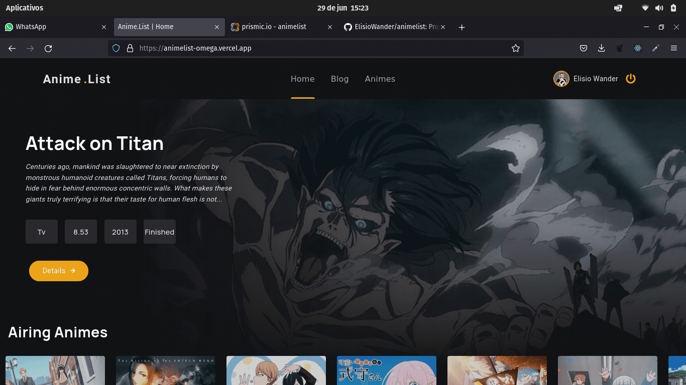
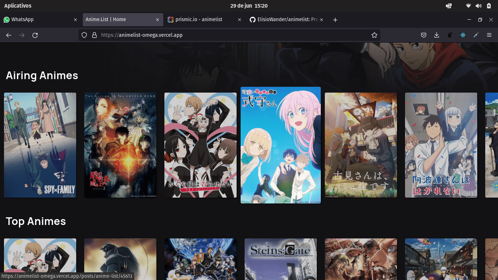
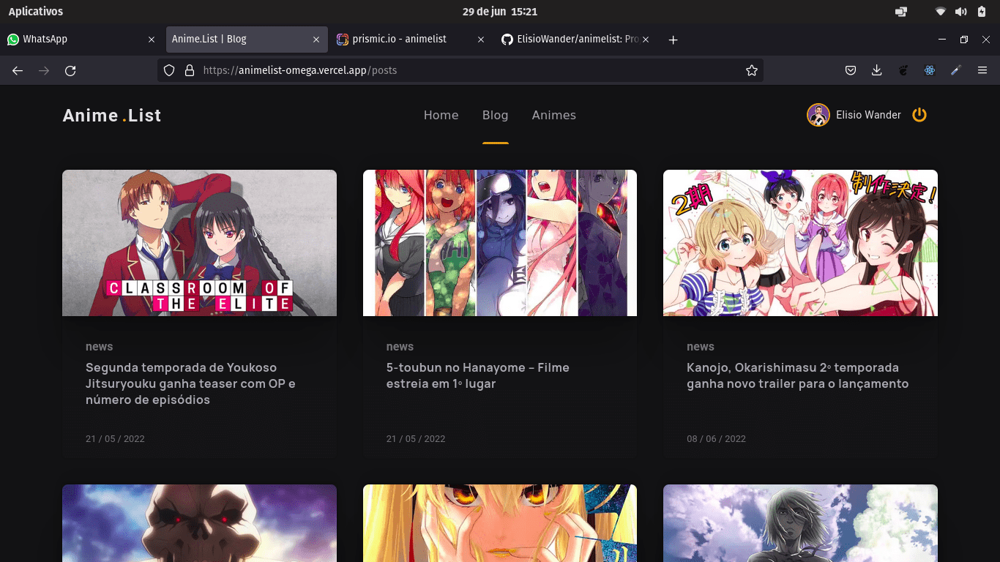
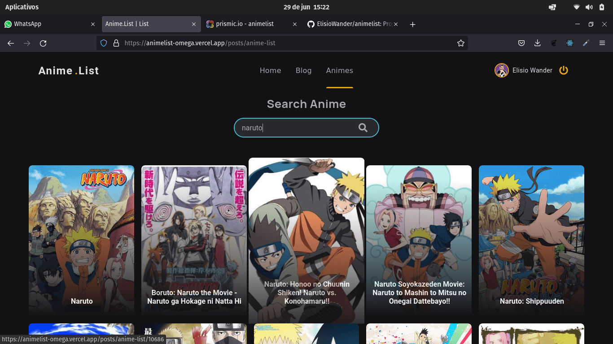
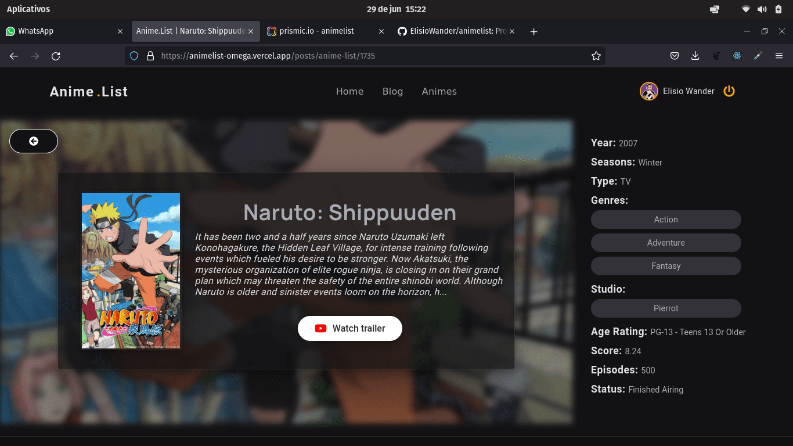

<h1 align="center">
    Anime.List
</h1>

<h1 align="center">
    
     
     
    
    
      
</h1>

## 🏷️ Sobre 
**AnimeList** é um site de animes onde você pode pesquisar por qualquer anime do seu interesse e ver as informações sobre ele, assim como o seu trailer. Também possue um blog com informações sobre o universo dos animes em geral - Site construido com o propósido de estudo.

---

## 🛠️ Tecnologias e serviços utilizados
Foram utilizadas as seguintes tecnologias para desenvolver a aplicação **AnimeList** :

- [Next](https://nextjs.org/)
- [Typescript](https://www.typescriptlang.org/)
- [React-Query](https://tanstack.com/query/v4/?from=reactQueryV3&original=https://react-query-v3.tanstack.com/)
- [Sass](https://sass-lang.com/)
- [Prismic](https://prismic.io/)

---

## 🗂️ Como baixar e iniciar o projeto 

```bash

    #clonar o projeto
    $ git clone https://github.com/ElisioWander/animelist.git

    #entrar no diretório
    $ cd animelist

    #instalar as dependências
    $ yarn

    #iniciar a aplicação
    $ yarn dev
```
### Servidor local
localhost:3000

---

## ⚠️ ALERT ⚠️
Lembrando que será necessário criar uma conta no [Prismic](https://prismic.io/) e seguir os passos
- Iniciar um repositório
- Configurar a Role como developer
- Configurar a tecnologia utilizada como Next.js ou React.js
- Criar um custom type como "Repeatable Type" com o nome "Post"
- Configurar a publicação contendo os seguintes elementos como obrigatórios: 
{
  "uid": "slug",
  "Image": "banner",
  "Title": "title",
  "Rich Text": "sinopse",
  "Rich Text": "director",
  "Rich Text": "design",
  "Rich Text": "studio",
  "Rich Text": "content",
  "Link": "video"
}

---

## Autor
### 👤 Elisio Wander

- Linkedin: [@elisioWander](https://www.linkedin.com/in/elisio-wander-b88b69136/)
- github: [@elisioWander](https://github.com/ElisioWander)

---
## 📝 Licença
Copyright © 2020 [@ElisioWander](https://github.com/ElisioWander/animelist/blob/main/LICENSE)

Este projeto está sobe a [LICENÇA MIT](https://opensource.org/licenses/MIT)

---

### Desenvolvido 💜 by Elisio Wander
